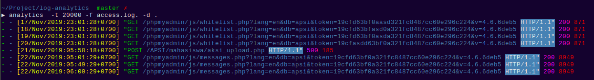

# log-analytics
[](https://travis-ci.com/luqmansen/log-analytics)
[](https://coveralls.io/github/luqmansen/log-analytics?branch=master)

Cli-tool for display log file analytics, specifically to read log file that
follow Common Log Format (https://en.wikipedia.org/wiki/Common_Log_Format).
Example provided is the default log file for access log on apache server

## Usage:
  ```
  analytics [flags]
```

## Flags:
| flag | alias | type | note |
|---|---|---|---|
  |-d |  --directory |string |Directory where the log file lies (default ".")|
  |-f| --file-name-pattern |string|   file name pattern to look for, follow apache log file naming format, just omit the number  (default "access.log.")|
  |-t| --time |int                  | Log file for the last "t" minute (default 30)|
  |-h| --help |                     |  help for analytics|
   |   |--config | string              |config file (default is $HOME/.analytics.yaml)|

## Demo
 